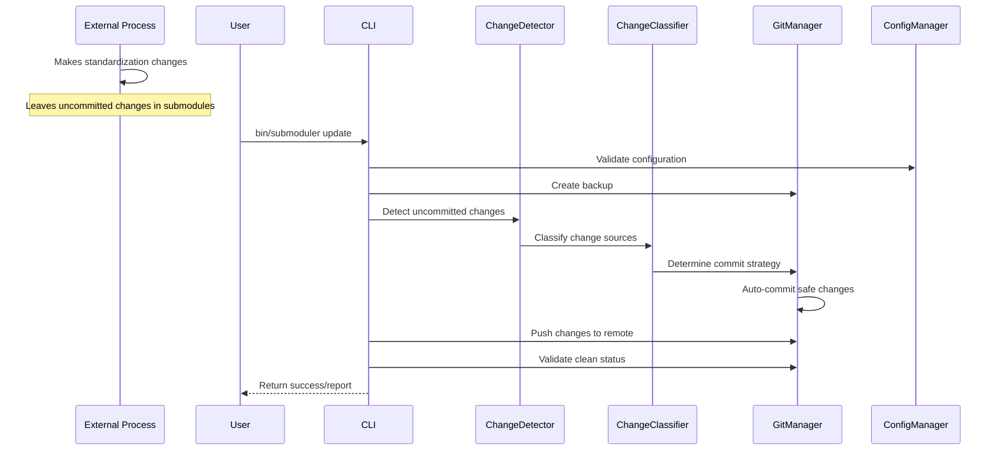

# Design Document

## Overview

This design implements a fix for the submoduler issue where `bin/submoduler update` leaves uncommitted changes in submodules, causing `git status` to show modified content. The solution involves understanding that submoduler's role is to use git to push changes to remote repos - it follows changes made by other processes rather than making the changes itself.

The core problem is that some other process (likely the standardization engine or dependency management system) is making legitimate standardization work (updating dependency names from `active_data_flow-core-core` to `active_data_flow` in gemspec files and require statements), but these changes are not being properly committed before submoduler tries to push them to remote repositories.

## Architecture

### High-Level Architecture

```
┌─────────────────────────────────────────────────────────┐
│                External Change Sources                   │
│  ┌────────────────────────────────────────────────────┐ │
│  │ Standardization Process (Unknown)                  │ │
│  │ - Updates gemspec dependencies                     │ │
│  │ - Fixes require statements                         │ │
│  │ - Makes other standardization changes              │ │
│  └────────────────────────────────────────────────────┘ │
└─────────────────────────────────────────────────────────┘
                              │
                              ▼ (leaves uncommitted changes)
┌─────────────────────────────────────────────────────────┐
│                 Submoduler Enhanced                      │
├─────────────────────────────────────────────────────────┤
│  ┌────────────────┐  ┌─────────────────────────────────┐ │
│  │ Change Detector│  │     Git Manager                 │ │
│  │ - Detect mods  │  │ - Pre-commit changes            │ │
│  │ - Categorize   │  │ - Backup/Rollback               │ │
│  │ - Report       │  │ - Status validation             │ │
│  └────────────────┘  └─────────────────────────────────┘ │
├─────────────────────────────────────────────────────────┤
│  ┌────────────────┐  ┌─────────────────────────────────┐ │
│  │ Config Manager │  │   Change Classifier             │ │
│  │ - Validation   │  │ - Identify change sources       │ │
│  │ - Strategies   │  │ - Determine commit strategy     │ │
│  │ - Options      │  │ - Validate change safety        │ │
│  └────────────────┘  └─────────────────────────────────┘ │
├─────────────────────────────────────────────────────────┤
│                 Existing Submoduler Core                │
│  ┌────────────────────────────────────────────────────┐ │
│  │  SubmodulerParent::CLI / SubmodulerChild::CLI      │ │
│  │  (Enhanced to handle uncommitted changes)          │ │
│  └────────────────────────────────────────────────────┘ │
└─────────────────────────────────────────────────────────┘
```

### Component Interaction Flow



## Components and Interfaces

### 1. Change Detector

**Purpose**: Detect and categorize uncommitted changes found in submodules before submoduler processes them

**Key Methods**:
- `detect_uncommitted_changes(submodule_path)`: Find all uncommitted changes in a submodule
- `categorize_change(file_path, diff)`: Determine the type and source of a change
- `generate_change_report()`: Create detailed summary of detected changes
- `get_changes_by_type(type)`: Filter changes by category
- `is_safe_to_auto_commit(change)`: Determine if change can be safely auto-committed

**Change Categories**:
- `gemspec_dependency`: Dependency name updates in gemspec files
- `require_statement`: Require path standardization
- `version_update`: Version number changes
- `metadata_update`: Other gemspec metadata changes

### 2. Git Manager

**Purpose**: Handle all git operations including backup, commit, and status validation before pushing to remote

**Key Methods**:
- `create_backup()`: Save current state before processing changes
- `auto_commit_changes(changes, strategy)`: Commit detected changes based on strategy
- `validate_clean_status()`: Ensure no uncommitted changes remain before push
- `rollback_to_backup()`: Restore previous state if issues occur
- `push_to_remote(submodule_path)`: Push committed changes to remote repository

**Commit Strategies**:
- `auto`: Automatically commit all submoduler changes
- `selective`: Commit only standardization changes
- `manual`: Leave all changes for manual review
- `dry_run`: Preview changes without applying

### 3. Change Classifier

**Purpose**: Analyze detected changes to determine their source and appropriate handling strategy

**Key Methods**:
- `classify_change_source(change)`: Determine if change is from standardization, user edit, or other source
- `is_standardization_change(change)`: Identify changes that match known standardization patterns
- `is_user_change(change)`: Identify changes that appear to be user modifications
- `get_commit_strategy(change)`: Return appropriate handling strategy for the change
- `validate_change_safety(change)`: Ensure change is safe to auto-commit

**Known Standardization Patterns**:
- `active_data_flow-core-core` → `active_data_flow` in gemspec dependencies
- `active_dataflow-*` → `active_data_flow-*` in gem names
- Require path updates to match standardized gem names

### 4. Config Manager

**Purpose**: Validate configuration and manage change handling strategies

**Key Methods**:
- `validate_submoduler_ini()`: Check .submoduler.ini validity
- `check_submodule_accessibility()`: Verify submodules exist
- `get_change_strategy(change_type)`: Return handling strategy
- `load_user_preferences()`: Read configuration options

**Configuration Options**:
- `auto_commit_standardization`: Boolean for auto-committing detected standardization changes
- `backup_before_update`: Boolean for creating backups before processing
- `dry_run_by_default`: Boolean for preview mode
- `change_strategies`: Hash mapping change types to handling strategies
- `require_clean_status`: Boolean for requiring clean git status before push

## Data Models

### Change Record

```ruby
class ChangeRecord
  attr_accessor :file_path, :change_type, :before_content, :after_content, 
                :timestamp, :submodule, :auto_committed

  def initialize(file_path:, change_type:, before_content:, after_content:, submodule:)
    @file_path = file_path
    @change_type = change_type
    @before_content = before_content
    @after_content = after_content
    @timestamp = Time.now
    @submodule = submodule
    @auto_committed = false
  end

  def diff
    # Generate unified diff between before and after content
  end

  def description
    # Human-readable description of the change
  end
end
```

### Backup State

```ruby
class BackupState
  attr_accessor :timestamp, :submodule_states, :backup_id

  def initialize
    @timestamp = Time.now
    @backup_id = SecureRandom.hex(8)
    @submodule_states = {}
  end

  def save_submodule_state(submodule_path)
    # Capture git state for rollback
  end

  def restore_submodule(submodule_path)
    # Restore from backup
  end
end
```

### Configuration Schema

```ruby
class SubmodulerConfig
  attr_accessor :auto_commit_standardization, :backup_before_update,
                :dry_run_by_default, :change_strategies

  def self.load_from_file(path = '.submoduler.config.yml')
    # Load YAML configuration
  end

  def validate!
    # Validate configuration values
  end
end
```

## Correctness Properties

*A property is a characteristic or behavior that should hold true across all valid executions of a system-essentially, a formal statement about what the system should do. Properties serve as the bridge between human-readable specifications and machine-verifiable correctness guarantees.*

### Property Reflection

After reviewing all properties identified in the prework, several redundancies were identified:
- Properties 1.2 and 7.2 both test categorization logic - consolidated into Property 2
- Properties 2.1 and 2.3 both test git status cleanliness - consolidated into Property 1
- Properties 3.4 and 7.1 both test logging functionality - consolidated into Property 3
- Properties 4.1 and 4.2 both test standardization consistency - consolidated into Property 4

### Core Properties

**Property 1: Git Status Cleanliness**
*For any* repository state, after submoduler update completes successfully, git status should show a clean working tree with no uncommitted changes in any submodule
**Validates: Requirements 2.1, 2.3**

**Property 2: Change Categorization Consistency**
*For any* set of file modifications made by submoduler, all changes should be correctly categorized by type (gemspec, require statements, etc.) and the categorization should be deterministic
**Validates: Requirements 1.2, 7.2**

**Property 3: Comprehensive Change Logging**
*For any* submoduler update operation, all file modifications should be documented in the change log with complete before/after states and categorization
**Validates: Requirements 1.1, 3.4, 7.1**

**Property 4: Dependency Name Standardization**
*For any* gemspec file and its corresponding require statements, after standardization all dependency names should be consistent and follow the correct naming convention
**Validates: Requirements 4.1, 4.2, 4.3**

**Property 5: User Change Preservation**
*For any* user-made modifications present before submoduler update, those changes should remain detectable and uncommitted after submoduler completes
**Validates: Requirements 2.4, 6.3**

**Property 6: Auto-commit Strategy Compliance**
*For any* change made by submoduler, the handling strategy (auto-commit, manual review, etc.) should be applied consistently according to the configured rules
**Validates: Requirements 3.1, 6.1, 6.2**

**Property 7: Configuration Validation Completeness**
*For any* .submoduler.ini configuration file, all validation checks should pass before update operations begin, and invalid configurations should be rejected with clear error messages
**Validates: Requirements 5.1, 5.2, 5.3, 5.4, 5.5**

**Property 8: Rollback State Restoration**
*For any* backup state created before submoduler update, rollback operations should restore all submodules to their exact pre-update state while preserving any user changes made after the update
**Validates: Requirements 8.1, 8.2, 8.5**

**Property 9: Dry-run Accuracy**
*For any* set of potential changes identified in dry-run mode, applying those changes in actual mode should produce exactly the same modifications
**Validates: Requirements 6.4**

**Property 10: Change Report Completeness**
*For any* submoduler update operation, the generated report should include all changes made, their categorization, handling strategy applied, and before/after states
**Validates: Requirements 7.3, 7.4, 7.5**

## Error Handling

### Strategy

1. **Configuration Errors**: Validate all configuration before starting updates
2. **Git Operation Errors**: Rollback to backup state on git failures
3. **File System Errors**: Preserve existing state, report specific failures
4. **Network Errors**: Graceful degradation for submodule accessibility checks
5. **Standardization Errors**: Log issues, continue with other files

### Error Categories

1. **Pre-flight Errors**: Configuration validation, submodule accessibility
2. **Runtime Errors**: File modification failures, git operation failures
3. **Post-processing Errors**: Report generation, cleanup failures

### Recovery Mechanisms

1. **Automatic Rollback**: On critical failures, restore backup state
2. **Partial Recovery**: Continue processing other submodules on individual failures
3. **Manual Recovery**: Provide tools for manual state restoration

## Testing Strategy

### Unit Tests

1. **Change Tracker**: Test change detection, categorization, and reporting
2. **Git Manager**: Test backup creation, auto-commit logic, status validation
3. **Standardization Engine**: Test dependency name mapping, consistency validation
4. **Config Manager**: Test configuration validation, strategy resolution

### Integration Tests

1. **End-to-End Workflow**: Test complete submoduler update with various configurations
2. **Git Integration**: Test git operations in real repository environments
3. **Error Scenarios**: Test recovery mechanisms and error handling
4. **Multi-submodule**: Test behavior across multiple submodules with different states

### Property-Based Tests

Property-based tests will be implemented using the `rspec-quickcheck` gem to verify the correctness properties across many randomly generated inputs.

Each property will be tested with at least 100 iterations to ensure robustness across various input combinations.

## Implementation Notes

### Technology Stack

- Ruby (existing submoduler codebase)
- Git command-line interface
- YAML for configuration files
- RSpec for testing framework
- rspec-quickcheck for property-based testing

### Integration Points

1. **Existing Submoduler CLI**: Enhance existing CLI classes with new functionality
2. **Git Integration**: Use existing git helper utilities where possible
3. **Configuration**: Extend existing .submoduler.ini with new options
4. **Logging**: Integrate with existing logging infrastructure

### Performance Considerations

1. **Backup Creation**: Use git references instead of full file copies
2. **Change Detection**: Implement efficient file comparison algorithms
3. **Parallel Processing**: Process multiple submodules concurrently where safe
4. **Memory Usage**: Stream large file comparisons to avoid memory issues

### Backward Compatibility

1. **Configuration**: New options should have sensible defaults
2. **CLI Interface**: Existing commands should continue to work
3. **Output Format**: Maintain existing output format with optional enhancements
4. **Git Workflow**: Should not interfere with existing git operations